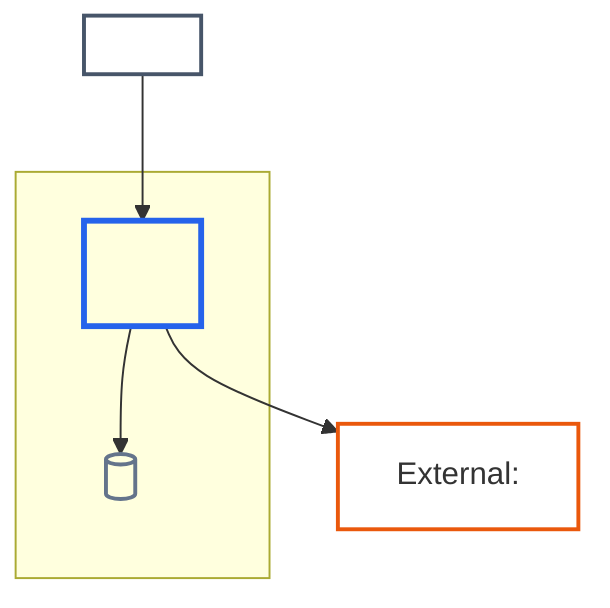

# Architecture diagram production patterns

Load this reference for context, container, component, dependency, or deployment
questions. Inventory boundaries and relationships before drawing. Use names from
the technical pages and evidence, not names invented for visual neatness.

## Choose the level

| Level      | Shows                                                                      | Omits by default                           |
| ---------- | -------------------------------------------------------------------------- | ------------------------------------------ |
| Context    | people, the system in scope, external systems, major relationships         | internal applications, services, classes   |
| Container  | deployable/runnable applications and data stores inside one system         | internal classes and most library detail   |
| Component  | meaningful components inside one selected container                        | unrelated containers and low-level classes |
| Deployment | runtime instances, zones, nodes, stores, protocols, scaling/failover facts | business workflow detail                   |

If a page needs a drill-down, use separate diagrams or explicit nested boundaries
with a visible zoom relationship. Never imply that a component is a deployable
container merely because both are drawn as boxes.

## Maintainable Mermaid template

Native C4 syntax is not available in every Mermaid integration. A flowchart with
explicit boundaries is portable and keeps the source easy to review.

Add a legend when multiple classes or line styles occur. Boundary labels state
the level and owning system/container where ambiguity is possible.

## Relationship discipline

- Every edge has a direction and a short purpose. Add protocol/technology only
  when evidenced and useful to the page.
- Do not show a database as directly used by a person unless that is the actual
  supported interaction.
- A bidirectional arrow means two independently supported directions; it is not
  shorthand for uncertainty.
- Queues, topics, buckets, databases, and external SaaS systems are not
  interchangeable. Use a distinct shape or label for their documented role.
- Trust, network, tenancy, region, cluster, and availability-zone boundaries are
  claims. Draw them only when verified.

## Deployment fallback

Mermaid subgraphs are sufficient for most deployments. Load
[plantuml.md](plantuml.md) only when the required view needs nested nodes,
deployment-specific notation, or swimlanes that the target Mermaid renderer
cannot express. Confirm the portal renders PlantUML before authoring it.

## Review checklist

- The title names the level and scope.
- The selected level answers the host page's question without unrelated detail.
- Every container/component/runtime node has one canonical name and owner.
- The diagram distinguishes our system, people, external systems, and data stores
  without relying on color alone.
- The diagram still agrees with the canonical runtime flow and dependency text.
