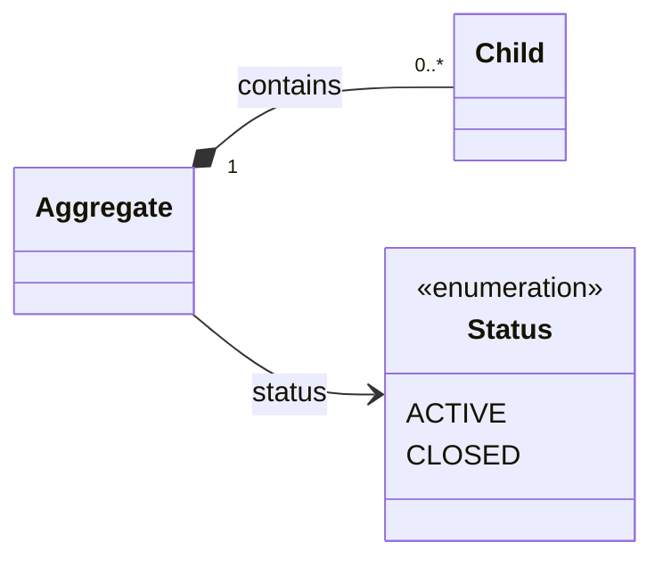
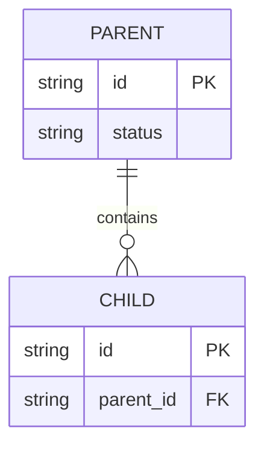
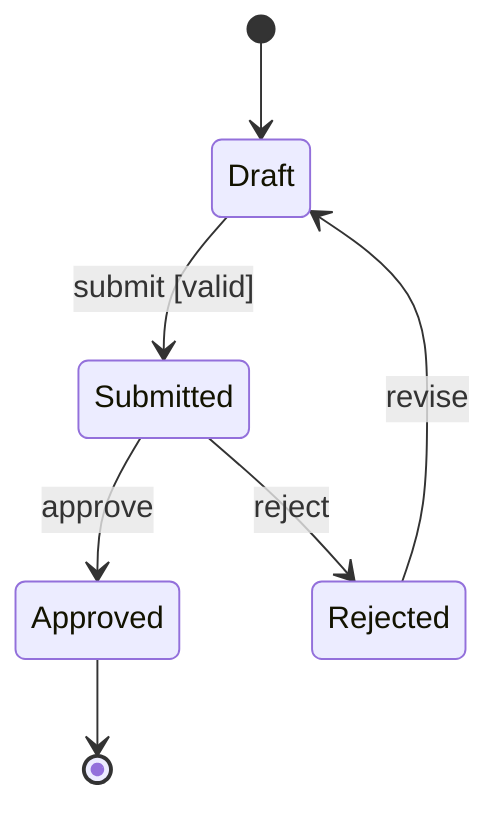

# Data, domain, and state production patterns

Load this reference only for domain/class models, persisted ER models, or entity
lifecycle/state diagrams.

## Domain model

Start from one canonical inventory containing concept name, definition,
relationships, direction, and cardinality. Keep business concepts independent of
storage tables and implementation classes.

- Use the same `PascalCase` concept names and relationship labels as the domain
  owner.
- Show attributes only when the host page needs them. Prefer portable conceptual
  types in a functional view; implementation mappings belong in technical prose.
- Do not add visibility symbols, getters, setters, repositories, DTOs, or every
  framework class unless the page explicitly documents implementation structure.
- An enumeration must be visibly identified, not merely colored differently.

When functional and technical projections both exist, generate them from the
same inventory. The technical projection may add evidenced attributes; concept
sets, relationships, labels, and cardinalities must reconcile exactly.

## ER model

Use an ER diagram only for persisted structures and evidence-backed keys.

- Copy table/entity and column names from the schema or agreed design.
- Verify optionality and cardinality in both the relationship and foreign-key
  nullability. Do not guess `1`, `0..1`, or many.
- Include only columns that explain identity, relationship, lifecycle, or the
  page's question. A complete schema dump is rarely a useful diagram.
- Put indexes, partitioning, retention, encryption, and store technology in
  prose unless they materially affect the relationship view.

## State model

One state diagram covers one named entity, aggregate, workflow, or UI state
machine. Edge labels name triggers; guards are bracketed.

- Every state is durable or observable according to the owner; do not turn each
  transient implementation step into a business state.
- Every transition has a supported trigger. Use guards only when their rule is
  documented.
- Model failure as a state only when the product persists or exposes it as one;
  otherwise represent it as a rejected transition or error outcome in prose.
- If parallel regions genuinely exist, label them and ensure the portal's
  renderer supports the chosen notation.

## Cross-check

For all three types, compare names, direction, cardinality/guards, and lifecycle
terminology with their canonical pages. A visually plausible relationship is not
evidence. Mark unresolved multiplicity or transition detail as unknown rather
than selecting a convenient default.
