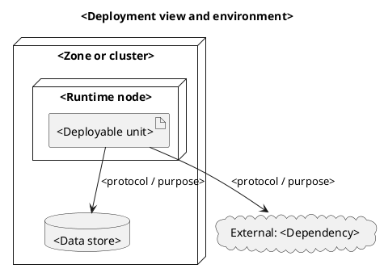

# PlantUML fallback

Load this reference only after [selection.md](selection.md) identifies a required
notation that the portal's Mermaid renderer cannot express. Confirm the existing
documentation build supports PlantUML; otherwise keep the model in Mermaid or use
a safe standalone SVG with its editable source recorded.

PlantUML can be appropriate for:

- nested deployment nodes or infrastructure zones;
- an established C4-PlantUML convention already used by the project;
- BPMN-like or swimlane activity notation required by the audience;
- object/instance diagrams that Mermaid cannot represent clearly.

It is not a fallback for color, spacing, or aesthetic preference.

## Deployment template

## Rules

- Start with `@startuml` and end with `@enduml`.
- Use one evidenced abstraction level and the canonical names from technical
  pages.
- Label relationships with purpose and protocol when known.
- Avoid remote includes unless the repository already pins and permits them;
  remote includes weaken reproducibility and can introduce unsafe content.
- Render with the same PlantUML version and theme as the portal build. Check
  clipping, contrast, and print output.
- Keep a text summary and evidence trail beside the diagram.

If the target build cannot render the block, stop and propose a supported output
instead of committing an invisible diagram.
