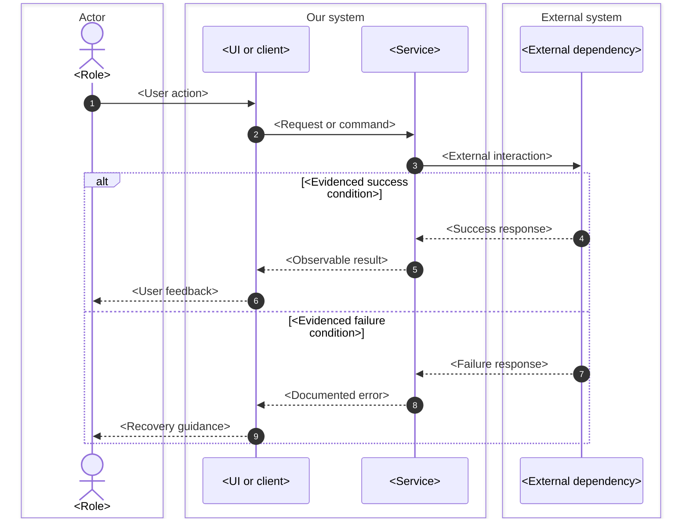
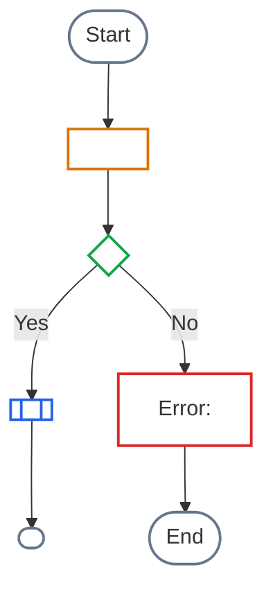

# Sequence and flow production patterns

Load this reference only for ordered interactions, decision logic, process flows,
or UI transition flows. Replace every placeholder with evidence-backed content;
the snippets demonstrate notation, not application behavior.

## Sequence template

Group participants by semantic boundary when that materially helps the reader.
Use actors for people and participants for systems. Requests use solid arrows;
responses or asynchronous acknowledgements may use dashed arrows when that
distinction is documented.

Production checks:

- Keep participant names stable across all messages and the host text.
- Show protocol/endpoint detail only when it answers the page question.
- Use `alt`, `opt`, `loop`, or `par` only for behavior the source explicitly
  supports. A long catalogue of rare errors belongs in a table, not one diagram.
- Avoid messages that merely say “process” or “handle”; use the observable
  command, event, result, or user feedback.

## Decision/activity template

Choose `TD` for a reader following a procedure and `LR` for a compact lifecycle.
Keep decision labels as questions and label every branch.

When two or more visual classes are used, put a plain-text legend immediately
before the diagram and list only classes actually present. Shape and wording
must still convey meaning without color: prefix negative terminal nodes with
“Error:” and external dependencies with “External:” where ambiguity is likely.

## Process and UI adaptations

- A process flow may group steps into role/system subgraphs when ownership is
  the point. Preserve one direction through all lanes and keep handoffs labelled.
- A UI transition flow uses named screens/states and user actions on edges. It
  does not duplicate field validation or full screen content.
- For a complex scenario, use sequence for cross-system orchestration and a
  separate decision flow only when the branching rules cannot be read clearly
  from the sequence. Cross-link both to the same owner.

## Syntax and layout checks

- Use stable ASCII node IDs and human-readable labels in quotes.
- Balance brackets and quote labels containing punctuation, parentheses, or
  slashes.
- Put class definitions and assignments after nodes and edges.
- Avoid one edge crossing several unrelated groups; split the diagram or add a
  clearly labelled intermediate boundary.
- Render the final source with the portal's Mermaid version; syntax accepted by
  another renderer is not sufficient.
